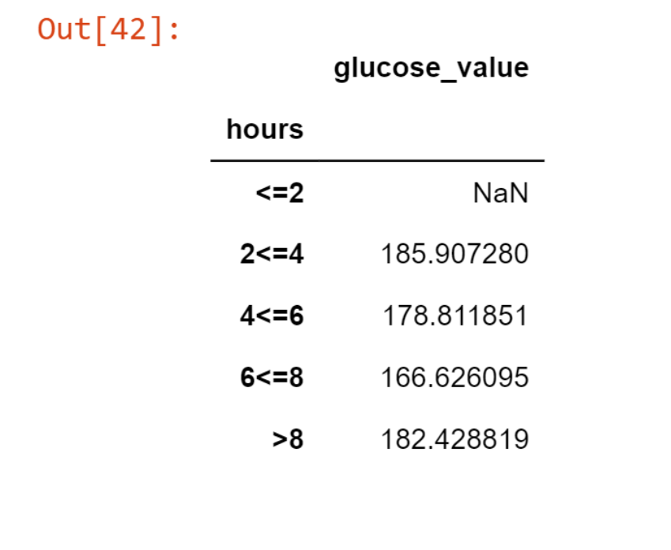

# ETL_Project

ETL: Extract, Transform, Load

For this project, I wanted to see if the amount of sleep I got affected my blood glucose values.  
Type I diabetes, also known as juvenile diabetes, is a chronic condition where a person’s pancreas produces little to no insulin. A person with type I diabetes requires insulin in order to allow glucose to enter cells to produce energy. A continuous glucose monitor or CGM is used to constantly measure the blood glucose level in the body. 

## Extract: 

The two data sources:
1. Dexcom estimated glucose values:
   - Date range: 8/8/19 to 11/5/2019
   - Format: CSV file
   - Data rows: 25,772 entries
2. Fitbit sleep values:
   - Date range: 8/8/2019 to 11/5/2019
   - Format: CSV file
   - Data rows: 83 entries

## Transform:

1. Transform CSV files into a Data Frame:
   1. Using Pandas and Python in Jupyter Notebook
2. Data cleaning:
   1. Copy only the columns and data needed
   2. Convert the timestamp to date only format
   3. Get rid of rows of unnecessary data
   4. Rename columns 
      - Get rid of spaces
      - Make sure column names match the column names in pgAdmin4 (see below)
   5. Drop NaN values
   6. Convert the values to appropriate data type for calculation purposes

## Load:

1. Create database and tables in pgAdmin4:
   1. Generate a new data base 
      - “T1D_db”
   2. Set up appropriate tables 
      - “cgm_data”
      - “sleep_data”
   3. Make sure to have the appropriate data type with column names
2. Load the clean data to Postgres:
   1. Use sqlalchemy’s create_engine to make connection to postgres
   2. Load the data to postgres
   3. Read the SQL query to make sure all data was loaded correctly

## Analysis:

After loading the data into the appropriate database, I read the data into Jupyter Notebook to do further analysis of the data collected. From the data, my average glucose value was actually the best when I had 6-8 hours of sleep. If I had less than 6 hours of sleep or more than 8 hours, the glucose values actually increased.  I also wanted to know if the amount of REM sleep had any affect on my glucose values. There is a slight decrease in the glucose value at 1-2 hours of REM sleep.  

For future analysis, I would like to pull more data and do more calculations on other factors. Other factors would be the amount of carbohydrates consumed, insulin injection sites, amount of insulin, activity level, etc.

## Issues faced during project:

Issues that I faced while doing the ETL project:
1. Finding the data set to use;
   1. The original project that I wanted to do was to find out the prevalence of type 1 DM by ethnicity
   2. After spending 2 days looking for data, I could not find anything about type 1 DM specifically. Almost all data sets available were for type 2 DM. There was a lot of data about Pima Indians but not for all ethnicities
   3. I then tried to find the average cost of insulin for people with type 1 DM in the US
      - I tried web scraping multiple pharmacy sites as well as health sites but there was too many discrepancies with the data
      - There were too many factors that affected the data I was collecting 
2. After not being able to find the data sets I wanted, I decided to change the scope of my project
   1. Pulled data from Dexcom for the last 90 days (that’s the most data you can pull at one time)
   2. Pulled data from my fit bit sleep info based on the time frame of the past 90 days
3. Another issue I faced was converting the datetime stamp as the date is what I will be combining the data on and the time stamp makes it too specific
   1. The date time was provided in date/time format but I did not need the time
   2. Used .dt.strftime('%Y-%m-%d') to get rid of the time stamp
4. For the glucose data, the table included event types (EGV, Insulin injection)
   1. Need to get rid of the rows of data that has any other entry other than EGV
5. Because the glucose data has multiple glucose values per day, I needed to find the average per day
   1. Was getting error at first – found out that there were other entries “High” and “Low” listed under the value column
   2. Using same method as above, dropped those rows
6. Dropped all Nan values in the tables to do calculations
7. When trying to create the tables in postgres, I was getting error in the naming
   1. I had originally created the cgm data table as CGM_table in capitals
   2. This caused a lot of issues
      - The error message said that the table did not exist 
      - The link it sent me to was the connection error link
   3. To solve this, I tried dropping the tables and creating new ones but I still got the same error, even after refreshing
   4. Next, I shut down everything and restarted my computer
      - I dropped all tables and created new ones with all lowercase tables
      - This solved the problem

## Tools Used:

  - Pandas
  - Python
  - SQLalchemy
  - pgAdmin4/PostgreSQL

----------------------------------------------------------------------------------------------------------

### Resources:

  - https://stackoverflow.com/
  - https://www.geeksforgeeks.org/
  - https://www.pgadmin.org/
  - https://docs.python.org/3/library/datetime.html
  - https://www.fitbit.com/us/home
  - https://www.dexcom.com/
  - https://guides.github.com/features/mastering-markdown/
  - https://help.github.com/en/github/writing-on-github/basic-writing-and-formatting-syntax

